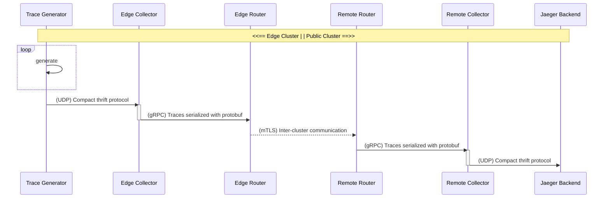

# Multi-cluster OpenTelemetry communication using Skupper

Securely connect an [OpenTelemetryCollector](https://github.com/open-telemetry/opentelemetry-collector) on your edge cluster to an OpenTelemetryCollector on a remote Kubernetes or OpenShift cluster using [Skupper](https://skupper.io/). For the communication between both collectors [gRPC](https://grpc.io/) is used. This example uses a publicly available cluster, as well as a [Kind](https://kind.sigs.k8s.io/) to create an edge cluster. For the installation of required components root permissions are requiered to install the [operator lifecycle manager](https://olm.operatorframework.io/) that is used to administer other Operator installations. If an OpenShift cluster is used as a public instance, the components to be installed can be found in the Red Hat [Marketplace](https://marketplace.redhat.com/en-us).

## Overview



## Prerequisites

- A cluster with a public address (Kubernetes or OpenShift) with ingress-nginx.
- An edge cluster (Kubernetes or OpenShift), in this tutorial we use [Kind](https://kind.sigs.k8s.io/).
- Optionally, the cluster status can be queried during setup using the [skupper-cli](https://github.com/skupperproject/skupper/blob/master/cmd/skupper/README.md) tool.

### Remote cluster

Make sure the follwing components are installed:

- ingress-nginx ([installation guide](https://kubernetes.github.io/ingress-nginx/deploy))
- cert-manager
- Jaeger-Operator
- OpenTelemetry-Operator
- Skupper-Operator

### Edge cluster

A `kind` edge cluster can be created with the following command. Kind registers the created cluster directly in your kubeconfig.

```bash
kind create cluster --name=skupper-edge
```

Make sure the follwing components are installed:

- OpenTelemetry-Operator
- Skupper-Operator

If components are missing, manifests for the installation of the [operator lifecycle manager](https://olm.operatorframework.io/) as well as subscriptions for the required operators are located in the [bootstrap folder](bootstrap).

All manifests provide a numeric prefix (`00-*, 10-*, ...`) and must be executed in the correct order. Using `find` and `sort` this can be done easily.

```bash
find -L bootstrap -name \*.yaml | sort | xargs -i kubectl apply -f "{}"
```

## Step 1: Configure the public accessible cloud

All manifests required for the installation are located in the [public-cloud](public-cloud) folder. A [Jaeger all-in-one](https://www.jaegertracing.io/docs/1.35/operator/#allinone-default-strategy) instance, an OpenTelemetry collector and a skupper site configuration are installed.

After a successful application, the following deployments and services should have been created automatically in the targeted namespace:

```bash
$ kubectl get deployments
NAME                           READY   UP-TO-DATE   AVAILABLE   AGE
jaeger-skupper                 1/1     1            1           46s
otel-collector-app-collector   1/1     1            1           46s
skupper-router                 1/1     1            1           43s
skupper-service-controller     1/1     1            1           43s

$ kubectl get services
NAME                                      TYPE           CLUSTER-IP       EXTERNAL-IP             PORT(S)                                  AGE
...
otel-collector-app-collector              ClusterIP      172.30.151.247   <none>                  4317/TCP,4318/TCP,55681/TCP              43s
skupper                                   LoadBalancer   172.30.135.186   *.*.elb.amazonaws.com   8080:32743/TCP,8081:32319/TCP            43s
skupper-router                            LoadBalancer   172.30.253.43    *.*.elb.amazonaws.com   55671:32766/TCP,45671:30461/TCP          43s
skupper-router-console                    ClusterIP      172.30.223.57    <none>                  8080/TCP                                 43s
skupper-router-local                      ClusterIP      172.30.104.235   <none>                  5671/TCP                                 43s
```

To make the collector service available later in the edge cluster, we use skupper-cli to expose it. (**TODO:** Figure out how this works without cli)

```bash
skupper expose service/otel-collector-app-collector --address "otel-liked-collector"
```

LoadBalancer entries are automatically created by skupper. More detailed information how to configure `skupper-site-controller` can be found [here](https://github.com/skupperproject/skupper/blob/a861728adfec261d2db2c8b5085fc99bcca3d4be/cmd/site-controller/README.md).

To establish an inter-cluster communication, certificates must be exchanged between the remote and edge clusters. Skupper generates the certificates and makes them available in a secret. In order to know which `secret` should be used to store the connection information the `secret` must be labeled with `skupper.io/type=connection-token-request`.

#### Result

```bash
$ kubectl describe secrets skupper-requested-secret
Name:         skupper-requested-secret
Namespace:    linked # depends
Labels:       skupper.io/type=connection-token
Annotations:  edge-host: *.*.elb.amazonaws.com
              edge-port: 45671
              inter-router-host: *.*.elb.amazonaws.com
              inter-router-port: 55671
              skupper.io/generated-by: d454838f-2ddb-420a-ac29-4051bf85c84a
              skupper.io/site-version: 1.0.0

Type:  Opaque

Data
====
ca.crt:   1159 bytes
tls.crt:  1269 bytes
tls.key:  1679 bytes
```

When setting up the edge cluster, this secret is **required**. The script `generate-private-token.sh` can be used to generate and export a secret with connection details. It gets stored in `private-cloud/10-exported-skupper-secret.yaml`.

## Step 2: Configure a private edge cluster

Make sure `private-cloud/10-exported-skupper-secret.yaml` is successful generated. Otherwise, a communication to your targeted remote cluster can *not* be established.

All manifests required for the installation are located in the [private-cloud](public-cloud) folder.

After a successful deployment the trace generator and skupper utilities should be placed in your targeted namespace:

```bash
$ kubectl get deployments
NAME                         READY   UP-TO-DATE   AVAILABLE   AGE
myapp                        1/1     1            1           46s
skupper-router               1/1     1            1           46s
skupper-service-controller   1/1     1            1           46s
```

#### (Optional) Connection verification

Using skupper-cli:

```bash
$ skupper network status
Sites:
├─ [remote] d454838 - public-site
│  name: public-site
│  namespace: linked
│  version: 1.0.0
│  ╰─ Services:
│     ╰─ name: otel-liked-collector
│        address: otel-liked-collector: 4317 4318 55681
│        protocol: tcp
│        ╰─ Targets:
│           ├─ name: otel-collector-app-collector
│           ├─ name: otel-collector-app-collector
│           ╰─ name: otel-collector-app-collector
╰─ [local] d529a86 - edge-site
   mode: edge
   name: edge-site
   namespace: default
   sites linked to: d454838-public-site
   version: 1.0.1
   ╰─ Services:
      ╰─ name: otel-liked-collector
         address: otel-liked-collector: 4317 4318 55681
         protocol: tcp
```

## Step 3: Trace inspection

Visit the Jaeger-UI to inspect transmitted traces.

```bash
$ kubectl port-forward deployments/jaeger-skupper 16686
Forwarding from 127.0.0.1:16686 -> 16686
```
